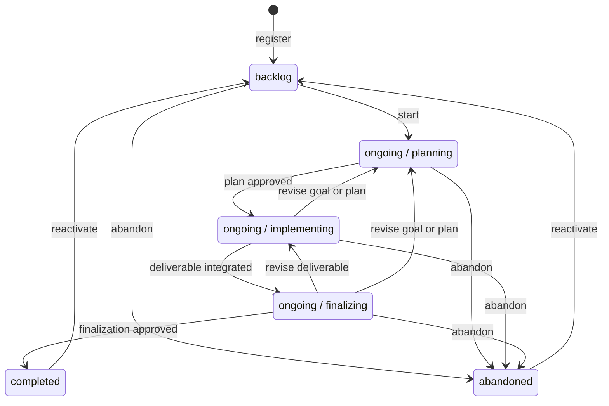

# Whatsnext 提示逻辑设计

本文是 [Task.md](./Task.md) 的提示逻辑设计。本文只定义 Repoledger 能观察到什么，以及
`repoledger whatsnext` 应输出什么。`State.yaml` 需要保存哪些字段、phase transition 如何
编码、哪些外部结果需要持久化，都在提示逻辑获批后再反推。

## 语言约束

本项目的 `repoledger.yaml` 配置 `taskLanguage: zh-CN`，本任务的 `Task.md` 也已固定
`Language: zh-CN`。因此 Agent 为本任务撰写的设计、决策、验证、证据说明和用户指引使用
中文；命令、标识符、协议字段、枚举值和原样工具输出保持技术形式。

此前英文 Design.md 不是语言解析优先级错误：项目默认值和任务语言都正确。缺口在于 Agent
没有把任务已记录语言应用到新增的普通 task narrative artifact，skill 与测试也只重点点名
Task、Progress 和 UserAcceptance。后续实现应把任务目录中所有 Agent-authored narrative
artifact 纳入相同语言规则，但不使用不可靠的自然语言检测器作为强制边界。

## Moore machine 边界

命令适配层先选定 task：

$$
selectedTask = select(taskArgument, ledgerIndex)
$$

选定 task 后，observer 生成完整状态：

$$
S = (L, P, A, G, C_p, C_g, R)
$$

- $L$：selected task 在 primary `tasks/status.yaml` 中的 coarse lifecycle record。
- $P$：ongoing task 当前的 `planning | implementing | finalizing` phase。
- $A$：Task、Progress、其他 task artifacts 及其 Git history。
- $G$：当前 worktree、index、HEAD、branch、push target、changes、conflicts 和 ancestry。
- $C_p$：项目 `repoledger.yaml` 与当前 phase 的项目 prompts。
- $C_g$：全局 Repoledger 配置。
- $R$：刷新后的 remote primary 与 task source refs。

`whatsnext` 是独立命令，输出是 Moore machine 的纯函数：

$$
Guidance = render(S)
$$

外层 `/repoledger exec|complete|abandon`、当前 conversation request、task selection 过程与
selection provenance 都不进入 $S$。相同 selected task 与相同 observation 必须得到相同
Guidance。

Guidance 是输出，不写进 `State.yaml`。Transition 是 human/external/tool event 触发的边，
不是当前状态字段。未来 `State.yaml` 只是 $S$ 中一个可能的持久化分量；本文不定义其格式。

## 状态图

Primary 只同步 coarse lifecycle；三个 active phase 都属于 `ongoing`。



图中的 label 只描述边的含义，不是状态字段。

## 规则链语义

每条规则统一写成：

```text
conditionName: 提示目标
```

Condition name 是 observation 的派生谓词名称，不等于未来 `State.yaml` 字段。每个规则块都
按文本顺序求值，等价于 `if / else if / ... / else`：第一个为 true 的 condition 决定唯一
输出，其余规则本轮不再执行。每个完整规则块以 `otherwise` 收束。

一次命令按以下层次运行：

1. 命令适配层执行 task selection 规则链。
2. Observer 执行 observation 诊断规则链。
3. `render` 先执行全局安全与同步规则链。
4. 全局链落入 `otherwise` 后，只执行 selected task 对应的一个 state 规则链。
5. Agent 执行 Guidance 后，harness 执行事件处理与循环推进规则链。

高层规则返回后，不进入低层规则。例如 worktree 存在 changes 时，本轮只输出检查和处理
changes 的提示，不同时输出 phase transition 或外部副作用。

## 命令适配规则链

该链发生在 prompt 计算前，返回诊断或 selected task，不生成 Guidance。

```text
taskArgumentUnknown: 返回 task-not-found 诊断，不修改 repository 状态，不调用 render。
taskSelectionAmbiguous: 返回 selection-required 诊断，不修改 repository 状态，不调用 render。
otherwise: 选定 task，调用 observer；render 不知道该 task 是由参数指定还是自动选择。
```

自动选择可以排除 `completed` 和 `abandoned`，但 selected task 一旦确定，terminal state 的
输出不再因选择方式或调用来源而变化。

## Observation 诊断规则链

该链发生在 `render` 前。任何诊断命中都不生成 Guidance。

```text
projectConfigInvalid: 返回可操作的项目配置诊断并停止。
globalConfigInvalid: 返回可操作的全局配置诊断并停止。
taskRecordInvalid: 返回可操作的 task record 诊断并停止。
taskArtifactInvalid: 返回可操作的 task artifact 诊断并停止。
phasePromptInvalid: 返回不安全路径、缺失文件或不可读内容的诊断并停止。
remoteRefreshFailed: 返回 fetch 或 authorization 诊断，不使用 stale tracking ref。
observationChangedDuringRead: 丢弃候选 snapshot 并重新观察。
otherwise: 生成稳定 snapshot，调用 render。
```

## 全局安全与同步规则链

该链先于所有 state-specific 规则。`worktreeHasChanges` 的提示要求 Agent 读取精确 diff；
Repoledger 只判断 Git shape 与 phase path legality，不自动判断任意内容的业务归属。

```text
hasUnresolvedConflicts: 停止正常工作；提示 Agent 在不丢弃任一侧的前提下处理冲突，然后重新观察。
worktreeBoundToOtherTask: 保留当前 worktree；提示使用匹配 selected task source target 的独立 worktree。
worktreeBindingInvalid: 保留当前 worktree；提示修复 detached HEAD、缺失/错误 push target 或 source identity 歧义，修复前不写 selected task。
worktreeHasChanges: 提示 Agent 读取精确 diff；必要且 phase-legal 的 task work 应精确 stage、累计检查并 commit；当前操作创建或 policy 可确定识别的临时产物可精确删除；未知、用户已有或无关工作必须保留并隔离或请求路径级决定；phase-illegal task work 必须先转到合法 phase；处理后重新观察。
localBehindSource: 提示执行显式 source sync；仅当 worktree clean、binding matching 且 proven fast-forward 时允许 Repoledger 自动执行 ff-only，随后重新观察。
localAheadSource: 提示运行当前 phase 的累计检查；通过后以 expected-tip CAS 非强推发布 source，失败则报告具体缺口。
localDivergedFromSource: 提示保留双方历史并执行正常非强推 integration；禁止 force-push、reset 或静默选择一侧，冲突交给 Agent。
sourcePrimaryRelationUnavailable: 返回 ancestry 诊断，不从 stale refs 猜测。
sourcePrimaryDivergedOutsideImplementing: 报告 primary gap；planning/finalizing 不导入 project changes，提示等待、先合法转 phase 或请求人工协调。
sourcePrimaryDivergedInImplementing: 提示在 dirty state 已处理后把 primary 显式合入 source，并保持旧 source tip 为 first parent，然后重新观察。
otherwise: 根据 coarse lifecycle 与 active phase 进入唯一 state-specific 规则链。
```

删除 changes 的安全边界属于 `worktreeHasChanges` 的固定提示目标：不得输出宽泛的
`git clean`、`git reset --hard` 或覆盖整个 worktree 的命令；只有当前操作创建、repository
policy 可确定识别，或用户在刷新 diff 后明确点名的路径可以删除。

## `backlog` 规则链

```text
hasConflictingSourceBranch: 报告 source conflict；不复用、不删除也不覆盖无法证明属于同一 recoverable start 的 branch。
hasRecoverablePartialStart: 提示按已验证的既有 start candidate 完成 roll-forward，不创建第二个 source identity。
otherwise: 提示 Repoledger 创建或确认 generation-specific source identity，执行 backlog -> ongoing 并进入 planning，然后重新观察。
```

Backlog 输出不因外层调用来自 `exec`、`status` 或 `abandon` 而改变。显式 abandon 请求由
独立 abandon workflow 处理，不是 `render` 输入。

## `ongoing / planning` 规则链

```text
planningRangeHasForbiddenPaths: 停止发布并保留变更；提示隔离非 task-folder 工作，或在当前计划获准后先进入 implementing 再处理 task deliverable。
taskContractMissingOrIncomplete: 输出 core planning prompt；提示只修改 task folder，完善 Goal、scope、out-of-scope、constraints 和可观察完成条件。
hasUnprocessedPlanningPrompt: 按项目配置顺序输出第一个尚未处理的 planning prompt；当前 prompt blocker/yield 未解除前不提前执行后续 prompt。
planningDecisionMissingOrStale: 展示当前权威 planning artifact，向用户请求绑定该 artifact 的明确决定，然后 yield。
planningDecisionRejected: 提示根据拒绝反馈修订 task artifacts，继续停留在 planning；旧决定不适用于新 artifact。
planningDecisionApproved: 提示调用 planning -> implementing phase transition 命令，然后重新观察。
otherwise: 报告 planning observation 不一致，列出无法归入上述条件的事实并停止副作用。
```

没有配置 planning prompt 时，`hasUnprocessedPlanningPrompt` 为 false；Repoledger 不补造 UX、
架构、数据模型、测试或其他领域 checklist。

## `ongoing / implementing` 规则链

```text
implementingRangeHasForbiddenPaths: 阻止 checkpoint 和 publication；保留对其他 task folder 或 tasks/status.yaml 的修改并提示协调。
implementingRangeHasNoDeliverableDelta: 输出 Task Goal 与当前项目 implementing prompts；提示调查 repository、修改 deliverable 并形成可观察结果。
hasUnprocessedImplementingPrompt: 按项目配置顺序输出第一个尚未处理的 implementing prompt；核心不假设项目一定有代码、unit test、build 或 deployment。
sourceTipNotContainedInPrimary: 提示通过 repository 正常 integration path 推进 source tip，并验证 primary 保留 source-tip ancestry；禁止 squash 擦除 task history。
integratedPrimaryNotContainedInSource: 提示把已集成 primary 明确同步回 source，并保持旧 source tip 为 first parent，然后重新观察。
implementingResultStale: 提示根据 primary/config/artifact 变化重新协调受影响范围，并重新执行相应项目 prompt；不得复用过期结论。
finalizingDecisionMissingOrStale: 汇总当前 deliverable、integration 与项目 prompt 结果，请求绑定当前 target 的 finalizing 决定，然后 yield。
finalizingDecisionRejected: 提示继续 implementing 并处理拒绝反馈；若反馈改变 Goal/plan，则按执行期 contingency 返回 planning。
finalizingDecisionApproved: 提示调用 implementing -> finalizing phase transition 命令，然后重新观察。
otherwise: 报告 implementing observation 不一致，列出无法归入上述条件的事实并停止副作用。
```

Implementing guidance 始终携带执行期 contingency：Agent 发现 Goal、scope 或计划需要改变时，
保留已有工作并先返回 planning，不静默扩大 contract。

## `ongoing / finalizing` 规则链

```text
finalizingRangeHasForbiddenPaths: 阻止 commit 和 publication；保留 deliverable 变化并提示先返回 implementing。
taskContractChangedDuringFinalizing: 提示返回 planning，重新确认 Goal 与计划后再继续。
deliverableTargetChangedDuringFinalizing: 提示返回 implementing，重新形成并集成 deliverable target。
externalResultAvailable: 提示先把可观察结果写入适当 task artifact 或后续确定的最小持久状态，再重新观察。
externalOperationWaiting: 说明精确等待对象和恢复条件，然后 yield；不以相同 snapshot 轮询。
hasUnprocessedFinalizingPrompt: 按项目配置顺序输出第一个尚未处理的 finalizing prompt；核心不预设文档发布、审批、部署、人工检查或其他领域动作。
completionDecisionMissingOrStale: 汇总 deliverable target 与 finalization 结果，请求绑定当前 artifact 的 completion decision，然后 yield。
completionDecisionRejected: 提示处理拒绝反馈；deliverable 变化返回 implementing，Goal/plan 变化返回 planning，否则继续 finalizing。
completionDecisionApproved: 提示执行 coarse ongoing -> completed transition，然后重新观察。
otherwise: 报告 finalizing observation 不一致，列出无法归入上述条件的事实并停止副作用。
```

没有配置 finalizing prompt 时，`hasUnprocessedFinalizingPrompt` 为 false；Repoledger 不凭空
要求 deployment、smoke test 或 manual acceptance。

## `completed` 规则链

```text
terminalWorktreeHasChanges: 保留本地变化；提示用户选择 reactivate、创建新 task 或对精确路径作明确处理，不把变化静默附着到已完成 generation。
retainedSourceHasUnintegratedWork: 把 retained source 作为只读历史证据报告；禁止自动 merge、删除 branch 或复用为新 generation source，并询问用户是否调整目标。
otherwise: 报告已完成目标、当前 generation 与可用 artifacts，询问用户是否调整目标或开启新一轮计划，然后 yield。
```

## `abandoned` 规则链

```text
terminalWorktreeHasChanges: 保留本地变化；提示用户选择 reactivate、创建新 task 或对精确路径作明确处理，不把变化静默附着到已放弃 generation。
retainedSourceHasUnintegratedWork: 把 retained source 与停止点作为只读历史证据报告；禁止自动 merge、删除 branch 或复用为新 generation source，并询问是否基于调整目标重新计划。
otherwise: 报告原目标、当前 generation、可用 artifacts 与停止点，询问是否基于调整目标重新计划，然后 yield。
```

## Prompt 执行期事件规则链

该链由 harness 在 Guidance 输出后处理，不属于 `render(S)`。

```text
humanRequestedArtifactRevision: 保持当前 phase，修改对应 task artifact；旧 decision 变为 stale，产生可观察 delta 后再调用 whatsnext。
humanApprovedSuggestedTransition: 调用 Guidance 指定的精确 Repoledger transition 命令；transition 成功并产生可观察 delta 后再调用 whatsnext。
humanRequestedAbandon: 进入独立 abandon workflow，取得绑定当前 task/generation 的确认；不要把请求本身传入 render。
humanDeclinedTerminalAdjustment: 结束当前 turn，不修改状态，也不再次调用 whatsnext。
humanRequestedTerminalAdjustment: 形成清晰修订意图，调用 completed/abandoned -> backlog reactivation；成功后再调用 whatsnext。
externalResultArrived: 将结果写入可观察 artifact 或后续确定的最小持久状态；产生 delta 后再调用 whatsnext。
otherwise: 继续执行当前 Guidance，或在输入含义不明确时请求澄清；不提前重新调用 whatsnext。
```

## 循环推进规则链

```text
snapshotChangedBeforeSideEffect: 放弃剩余 Guidance，重新观察并生成新输出。
expectedDeltaObserved: 重新调用 whatsnext。
unexpectedDeltaObserved: 丢弃剩余 Guidance，重新观察并生成新输出。
executionWaitingWithoutDelta: 结束当前 Agent turn；收到对应 human/external input 后由事件规则链处理。
actionableErrorObserved: 报告具体 blocker 与恢复条件；错误消除前不重复副作用。
guidanceFinishedWithoutDelta: 报告 no-progress 并停止，禁止在相同 snapshot 上空转。
otherwise: 继续当前 macro-step，不重新调用 whatsnext。
```

## 从条件反推 observation 与 state detail

Condition name 是设计期派生谓词，不预设持久字段。下一轮逐个 predicate 识别信息来源：

| Condition family | 已知或候选来源 | 当前结论 |
| --- | --- | --- |
| Coarse lifecycle、source identity | primary `tasks/status.yaml` | 已可观察。 |
| 当前 ongoing phase | task source history 与未来最小 task-state 分量 | 待推导持久化方式。 |
| `*RangeHasForbiddenPaths`、deliverable delta | phase base 到 candidate 的累计 Git 变更 | 可推导。 |
| Worktree/ref relation predicates | index、worktree、refreshed refs 与 commit graph | 可推导。 |
| `hasUnprocessed*Prompt` | 项目配置、prompt revision、artifacts、可重查结果或最小持久事实 | 待逐 prompt 判断。 |
| `*DecisionMissingOrStale`、`*DecisionApproved/Rejected` | 当前 human input；跨 session 时可能需要绑定 artifact 的持久事实 | 待推导。 |
| `externalOperationWaiting`、`externalResultAvailable` | 可重查 external system；无法稳定重查时可能需要非秘密持久事实 | 待推导。 |
| Snapshot stale 与 loop delta predicates | before/after observation 与 execution outcome | 可推导，不持久化。 |

只有无法从 Git、task artifacts、project/global config 与 remote refs 重建、又确实影响未来
predicate 的事实，才进入最小 state detail。Guidance、next action、transition edge、condition
name 和可从 Git 推导的 phase base 都不应持久化。

## 当前待评审结论

- `whatsnext` 独立于外层 skill verb；selected task 的相同 snapshot 永远产生相同 Guidance。
- 每个规则块按文件顺序构成严格 `if / else if / ... / else`，只输出第一个命中分支。
- 每条提示规则统一使用 `conditionName: 提示目标`。
- Coarse lifecycle 为 `backlog | ongoing | completed | abandoned`；ongoing phases 为
  `planning | implementing | finalizing`。
- 状态图使用 Mermaid；项目 prompts 提供领域语义，Repoledger core 只提供 lifecycle、
  Git、安全与协作约束。
- Worktree/remote reconciliation 先于 state-specific work，未知本地变更默认保留。
- 先批准 predicate chains，再为不可推导 predicates 设计最小 `State.yaml`；当前不采纳具体
  State schema。