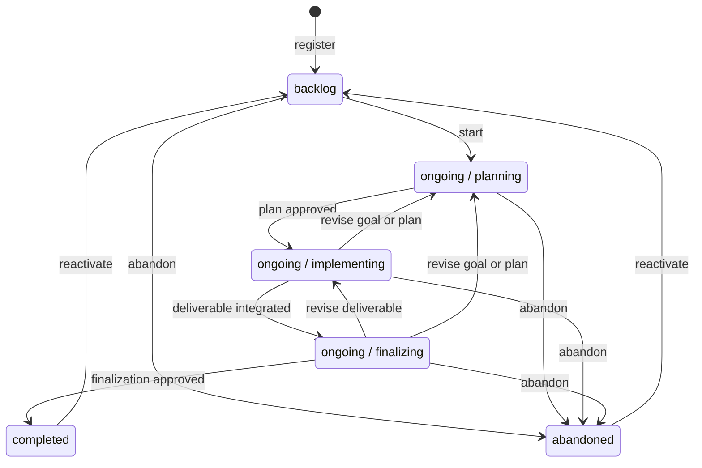

# Whatsnext 提示逻辑设计

本文是 [Task.md](./Task.md) 的提示逻辑设计。本文先回答一个问题：在 Repoledger 能观察
到的完整状态下，应该给 Agent 什么可执行提示。`State.yaml` 需要保存哪些字段、phase
transition 如何编码、哪些外部结果需要持久化，都在提示逻辑稳定后再反推，不在本文预设。

## 语言约束

本项目的 `repoledger.yaml` 配置 `taskLanguage: zh-CN`，本任务的 `Task.md` 也已固定
`Language: zh-CN`。因此 Agent 为本任务撰写的标题、设计、决策、验证、证据说明和用户
指引都应使用中文；命令、标识符、协议字段、枚举值和原样工具输出保持英文。

此前 Design.md 使用英文不是语言解析优先级错误：项目默认值已经正确写入任务。它同时
暴露了两个缺口：

1. Agent 没有把任务已记录的语言应用到新增的普通 task narrative artifact。
2. 当前 skill 和测试重点点名 Task、Progress 与 UserAcceptance，checker 只校验
   `Task.md` 的 `Language:` 元数据，不验证其他叙述性 task artifact 的语言。

后续实现应把“任务目录中由 Agent 撰写的所有叙述性 artifact”纳入 task language 规则。
不应依赖不可靠的自然语言自动识别来强制内容语言，但 skill、模板和测试必须明确覆盖该
范围。

## 建模边界

Repoledger 不是只根据一个 YAML 文件工作的状态机。一次 observation 得到的完整状态可
抽象为：

$$
S = (L, P, A, G, C_p, C_g, R)
$$

其中：

- $L$：primary `tasks/status.yaml` 中的 coarse lifecycle record。
- $P$：ongoing task 当前的 `planning | implementing | finalizing` phase。
- $A$：Task、Progress、其他 task artifacts 及其 Git history。
- $G$：当前 worktree、index、HEAD、branch、push target、changes、conflicts 和 ancestry。
- $C_p$：项目 `repoledger.yaml` 与当前 phase 的项目 prompts。
- $C_g$：全局 Repoledger 配置。
- $R$：刷新后的 remote primary 与 task source refs。

`repoledger whatsnext` 是独立命令。命令适配层在 observation 之前根据可选 task 参数和
ledger index 选定一个 task，或返回 selection 诊断：

$$
selectedTask = select(taskArgument, ledgerIndex)
$$

$$
S = observe(selectedTask)
$$

Task selection 决定“观察哪个 task”，但不进入 $S$，也不改变 `render(S)`。外层 skill
是通过 `/repoledger exec`、`/repoledger complete`、`/repoledger abandon`，还是其他方式
调用 `whatsnext`，都不会传入 prompt 计算。相同 selected task 与相同 observation 必须产生
相同 guidance。

未来的 `State.yaml` 只是 $S$ 中一个可能的持久化分量，不是整个状态节点。本文不规定它
的字段。

`whatsnext` 的输出是 Moore machine 的输出函数：

$$
Guidance = render(S)
$$

Agent 执行 Guidance，可能产生 Git、task artifact、remote、human input 或外部系统副作用，
随后 observer 得到 $S'$。合法 transition 是 $S \rightarrow S'$ 的边，不是 $S$ 中的字段。

因此：

- guidance 不写进 `State.yaml`；它由完整 observation 计算。
- transition 不写成“当前状态的一部分”；它是命令或 human/external event 触发的边。
- human reply、外部结果和 Agent 执行中的语义发现是 transition input，不是预先存在的
  snapshot predicate。
- `/repoledger` verb、当前用户请求和 conversation intent 不属于 `render` 输入；需要它们
  触发的 abandon 等操作由独立命令/harness 处理。
- 只有无法从 Git、artifacts、config 与 remote 重建、但又必须跨会话保留的事实，才可能
  在后续设计中成为持久 state detail。

## 状态图

Primary 只同步 coarse lifecycle；三个 active phase 都属于 `ongoing`。

图中的 label 是 transition 含义，不是当前状态字段。是否已经具备某条边的条件，必须由
observer 能证明的事实与本轮明确 human/external input 共同决定。

## 输出优先级

同一 observation 可能同时命中多条规则。为使输出确定，`render` 按以下优先级选择当前
macro-step：

1. merge conflict、worktree binding 与未知本地变更保护。
2. local/source/primary 同步与并发冲突。
3. 当前 lifecycle/phase 的核心规则。
4. 当前 phase 的项目 prompts。
5. human/external yield、requery 和 no-progress 终止规则。

Selection 与 observation 诊断发生在 `render` 之前，不参与这套优先级。

高优先级 blocker 未处理前，不输出低优先级副作用。例如 worktree 中存在未知用户变更时，
不得先输出 phase transition、commit 或部署操作。

## 通用观察与提示逻辑

以下规则适用于所有 lifecycle/phase。

### 命令入口与 observation 诊断

以下行为发生在 guidance 计算之前，不是 `render(S)` 的条件：

- 在 task 参数指向未知 task 的情况下，命令应返回 task-not-found 诊断，不生成 prompt。
- 在未提供 task 参数且 ledger index 不能按确定规则唯一选择 task 的情况下，命令应返回
  selection-required 诊断，不生成 prompt。
- 命令的自动选择规则可以排除 terminal task；一旦 task 已选定，`render` 只观察其状态，
  不知道它是由参数指定还是自动选择。
- 在项目配置、全局配置、task record、task artifact 或 phase prompt 无法解析的情况下，
  observer 应返回可操作诊断，不调用 `render`。
- 在 remote primary 或 active source ref 无法刷新时，应报告 fetch/authorization 诊断，
  不使用 stale tracking ref 生成 prompt。
- 在 observation 期间任一原始输入发生变化的情况下，应丢弃候选 prompt 并重新观察。

### 工作树绑定

- 在 ongoing task 的当前 branch canonical push target 与 advertised source target 匹配的
  情况下，应继续检查 dirty state 与 ref relation。
- 在 target 不匹配、detached HEAD、push destination 缺失或 source identity 有歧义的
  情况下，应保留当前 worktree，指示建立或使用匹配 source target 的独立 worktree；修复
  前不得产生该 task 的写入。
- 在一个 worktree 已承载另一 active task 的可变工作时，应保留现状并使用独立 worktree；
  list/status/check 等只读操作不受限制。

### 工作区变更

Repoledger 只能判断 Git shape 与 phase path legality，不能自动判断任意内容的业务归属。
观察到 changes 时，prompt 应要求 Agent 读取精确 diff，并按下表处理：

| 观察结果 | 应指示 Agent |
| --- | --- |
| 变更是当前 task 必要工作，且当前 phase 允许这些路径 | 保留变更，精确 stage 预期路径，运行累计检查，再按 task workflow commit。 |
| 变更是当前操作刚创建的临时产物，或 repository cleanup policy 可确定识别 | 可以删除该精确产物，然后重新观察。 |
| 变更是未知来源、用户已有或与当前 task 无关 | 保留，不 reset、clean、checkout、覆盖或静默 stash；改用独立 worktree，或请求用户对精确路径做决定。 |
| 变更属于当前 task，但当前 phase 不允许该路径 | 保留，先走合法 phase transition，或在干净且匹配的 worktree 中继续；不得伪装成当前 phase 变更。 |
| 存在 unresolved conflict | 停止正常 guidance，要求在不丢弃任一侧的前提下处理冲突，再重新观察。 |

- 在 Agent 只能主观判断某项变更“无关”的情况下，不应自动删除。
- 在用户明确授权丢弃某些具体路径的情况下，应先刷新 diff，再只处理被点名路径。
- 不应输出宽泛的 `git clean`、`git reset --hard` 或覆盖整个 worktree 的命令。

### 本地与 source ref

- 在 local HEAD 等于 fetched source tip 的情况下，应在 dirty-state 处理完成后进入当前
  phase guidance。
- 在 local HEAD 落后 source、worktree clean 且关系可 fast-forward 的情况下，应输出
  source sync step；显式 Repoledger sync 命令可以自动执行 `ff-only`，随后重新观察。
- 在 local HEAD 落后 source 且 worktree dirty 的情况下，应先分类并安全 commit、删除
  来源明确的临时产物，或保留并隔离未知工作；不得直接 pull/merge 覆盖本地内容。
- 在 local HEAD 领先 source 的情况下，应先运行当前 phase 所需累计检查，再以 expected-tip
  CAS 非强推发布；检查失败时继续当前 phase，不发布。
- 在 local 与 source diverged 的情况下，应保留双方历史并输出正常非强推 integration
  step；不得 force-push、reset 或静默选择一侧。冲突交还 Agent 处理。

### 远端 source 与 primary 关系

- 在 primary 是 source 的 ancestor 时，应视为 source 含 active task work，根据 local/source
  关系继续工作或发布。
- 在 source 是 primary 的 ancestor 时，应视为 task work 已进入 primary；只有当前 phase
  的下一步需要时，才明确把 primary 同步回 source，并保持旧 source tip 为 first parent。
- 在 source 与 primary diverged 且当前 phase 为 `implementing` 时，应在 dirty-state 协调后
  输出显式 primary-to-source integration step，并保持 source first-parent lineage。
- 在 source 与 primary diverged 且当前 phase 为 `planning` 或 `finalizing` 时，不应自动
  导入 project changes；应报告 gap，并根据具体 task-folder/phase 条件选择等待、先转 phase
  或请求人工协调。
- 在 relation 无法计算的情况下，应返回 ancestry 诊断，不从 stale refs 猜测。
- 在 checked-out primary worktree clean 且仅落后 fetched primary 时，显式 sync step 可
  `ff-only`；dirty 或 diverged primary worktree 必须保留并报告。

### 项目 prompts

- 在当前 phase 没有配置项目 prompt 的情况下，应只输出 core phase guidance，不报错也不
  补造领域 checklist。
- 在当前 phase 配置多个项目 prompts 的情况下，应按配置中的稳定顺序编译；当前 prompt
  产生 blocker 或 yield 时，不提前执行后续 prompt。
- 在项目 prompt 与 core lifecycle、安全、权限、phase path 或 publication 规则冲突的
  情况下，应报告 configuration conflict 并停止，不通过“后写覆盖前写”降低核心约束。
- 在项目 prompt path 不安全、文件缺失、内容无法读取或 observation 期间发生变化的情况下，
  应丢弃候选 bundle，返回可操作诊断或重新观察。
- 在项目 prompts 变化后旧 prompt 仍在执行的情况下，应在任何新副作用前比较 snapshot，
  放弃旧输出并重新编译；prompt 文本本身不作为持久 state。

## `backlog` 提示逻辑

`backlog` 表示 task 已登记，但尚未建立 active source execution。

- 在 selected task 的 coarse lifecycle 为 `backlog`、配置有效且没有更高优先级 blocker 的
  情况下，应固定指示 Repoledger 创建/确认 generation-specific source identity，执行
  `backlog -> ongoing` 并进入 `planning`，然后重新观察。
- 在开始前当前 worktree 含未知或用户已有 changes 的情况下，应先保护这些 changes，并在
  独立 worktree 中开始 task，而不是搬运或删除它们。
- 在开始所需 source branch 已存在但不能证明是同一个可恢复 start publication 的情况下，
  应报告 source conflict，不复用或覆盖该 branch。

`whatsnext` 不因外层调用来自 `exec`、`status` 或 `abandon` 而改变 backlog 输出。显式
abandon 请求由独立 abandon workflow 取得 human decision 并执行 coarse transition。

## `ongoing / planning` 提示逻辑

`planning` 的目标是形成可执行的任务契约并取得进入实现阶段的明确决定。该 phase 只允许
修改当前 task folder。

- 在累计 planning range 出现 task folder 外路径的情况下，应停止发布并保留变更；如果它
  是当前 task 必要工作，则在计划获准后先 transition 到 `implementing`，否则隔离处理。
- 在 Task contract 缺失、不完整，或当前项目 planning prompts 尚未执行的情况下，应输出
  core planning prompt 与项目 planning prompts，指示 Agent 只修改 task folder，完善 Goal、
  scope、out-of-scope、constraints、可观察完成条件与适用领域计划。
- 在 repository 没有配置 planning prompt 的情况下，不应报错；应仅使用 core planning
  prompt，而不是假设必须有 UX、架构、数据模型或软件测试章节。
- 在 planning task artifacts 有未提交变化的情况下，应先检查精确 diff、task links 和
  contract 一致性，再 commit 并非强推发布 source；不得制造无意义的 task-only 日志提交。
- 在 local/source 有 gap 的情况下，应先执行通用同步逻辑，再继续请求 review。
- 在计划产物已发布，但当前 observation 中没有可验证的“允许进入 implementing”决定事实
  时，应展示权威 planning artifact，向用户请求明确决定并 yield。
- 在 observation 能证明当前 planning artifact 的有效批准事实后，应指示执行
  `planning -> implementing` 边，然后重新观察；如何跨 session 证明该事实留待
  state-detail 设计。

Planning guidance 必须携带执行期分支：human 要求修改时继续 planning 并更新 artifact；
human 批准时调用 phase transition 命令；human 请求 abandon 时交给独立 abandon workflow。
这些分支是 prompt 执行方式，不是 `render` 的输入条件。

## `ongoing / implementing` 提示逻辑

`implementing` 允许修改当前 task folder 和 repository deliverable，但不允许改其他 task
folder 或手工修改 `tasks/status.yaml`。

- 在当前 Goal 或项目 implementing prompts 仍有未处理工作时，应指示 Agent 调查 repository、
  修改 deliverable、运行适合该 repository 的验证或质量检查，并形成可观察结果；核心不
  假设项目一定有代码、unit test、build 或 deployment。
- 在 worktree 有未提交 changes 时，应先走通用 dirty 分类；必要 task work 精确 stage，
  检查从当前 implementing base 到 candidate 的累计 range，再 commit。
- 在累计 range 修改其他 task folder 或 `tasks/status.yaml` 的情况下，应阻止 checkpoint/
  publication，保留并协调这些变更。
- 在最新 commit 只修改 task folder、但当前 implementing 累计 range 已包含对应 deliverable
  delta 的情况下，不应仅因 latest commit 是 task-only 就失败；检查对象是累计 range。
- 在 deliverable 变化尚未形成 repository profile 要求的 journal、证据或项目 guidance
  结果时，应输出相应 implementing prompt，继续当前 macro-step，不进入 finalizing。
- 在 local HEAD 领先 source 且累计 checkpoint 合法的情况下，应指示非强推发布 source；
  不合法时给出具体缺口。
- 在 source work 尚未进入 primary 的情况下，应指示通过 repository 正常 integration path
  推进，并验证 primary 包含 source tip；不得用 squash 擦除 task history。
- 在 primary 集成后发生新 primary 变化，导致当前结果需要重新协调的情况下，应重新同步、
  检查受影响范围并运行项目 prompts 所需验证，而不是复用过期结论。
- Implementing guidance 应始终包含执行期 contingency：Agent 发现 Goal、scope 或计划需要
  变化时，保留已有工作并调用 `implementing -> planning`，不得静默扩大 contract。
- 在 deliverable 已进入 primary，当前 implementing prompts 的要求已处理，但没有可验证的
  “允许进入 finalizing”决定事实时，应汇总实现、集成与验证结果，请求明确决定并 yield。
- 在 observation 能证明当前 deliverable target 的有效 finalizing 批准事实后，应指示执行
  `implementing -> finalizing` 并重新观察；持久证明方式后续再设计。

Implementing guidance 中的 human abandon 请求同样交给独立 abandon workflow，不作为
`whatsnext` 的输入。

## `ongoing / finalizing` 提示逻辑

`finalizing` 只允许修改当前 task folder 和操作外部工具；任何 repository deliverable 变化
都必须先返回 implementing。

- 在累计 finalizing range 出现 task folder 外路径的情况下，应阻止 commit/publication，
  保留变化并指示 `finalizing -> implementing` 后再处理。
- Finalizing guidance 应始终包含执行期 contingencies：发现 deliverable 需要变化时返回
  implementing；发现 Goal、scope 或计划需要变化时返回 planning。
- 在当前项目 finalizing prompts 尚未执行的情况下，应输出下一项适用 prompt，指示 Agent
  执行文档发布、外部审批、部署、人工检查或其他项目自定义动作；核心不预设其中任何一项。
- 在 repository 未配置 finalizing prompt 的情况下，不应凭空要求 deployment、smoke test
  或 manual acceptance；应直接进入 final completion readiness 判断。
- 在外部操作已经启动、当前只能等待 human/external input 的情况下，应说明精确等待对象
  和恢复条件，然后 yield；不立即用相同 snapshot 轮询。
- 在外部结果已返回的情况下，应先把可观察结果写入适当 task artifact 或后续确定的持久
  state component，再重新观察；本文不预设其 schema。
- 在 finalizing task artifacts 有未提交变化的情况下，应检查 task-folder-only range，
  commit 并非强推发布 source。
- 在 finalizing prompts 均已处理，但没有可验证的最终完成决定事实时，应汇总 deliverable
  target 和 finalization 结果，请求明确 completion decision 并 yield。
- 在 observation 能证明当前 deliverable/finalization artifact 的有效 completion decision，
  且 source/primary/dirty-state 条件满足的情况下，应指示执行 coarse
  `ongoing -> completed`，随后重新观察。

Finalizing guidance 中的 human abandon 请求交给独立 abandon workflow，不作为
`whatsnext` 的输入。

## `completed` 提示逻辑

`completed` 是用户已确认没有剩余工作的终态。Task selection 是否默认排除终态发生在
命令适配层；一旦 selected task 为 completed，输出不再区分“显式查询”或调用来源。

- 在 selected task 的 coarse lifecycle 为 `completed` 的情况下，应报告已完成目标、当前
  generation 和可用 artifact，并要求 Agent 询问用户是否要调整目标或开启新一轮计划，
  然后 yield。
- 在 terminal task 后出现本地 deliverable changes 的情况下，不应静默附着到已完成
  generation；应保留并要求用户选择 reactivate、创建新 task 或明确处理这些变化。

Completed guidance 的执行期分支为：human 无需调整时结束当前 turn，不重新调用
`whatsnext`；human 要求调整时形成修订意图并调用 `completed -> backlog` reactivation。
Human reply 不是本次 `render` 的输入。

## `abandoned` 提示逻辑

`abandoned` 表示当前 generation 的目标被明确终止。Task selection 可以默认排除它；一旦
selected task 为 abandoned，输出不再区分调用来源。

- 在 selected task 的 coarse lifecycle 为 `abandoned` 的情况下，应报告原目标、可用
  artifact 和停止点，并要求 Agent 询问是否基于调整后的目标重新计划，然后 yield。
- 在 retained source branch 存在未集成工作时，应把它作为只读历史证据报告；不得自动
  merge、删除 branch 或把旧 source 当作新 generation source 复用。

Abandoned guidance 的执行期分支为：human 保持 abandoned 时结束当前 turn；human 要求恢复
或调整目标时形成修订意图并调用 `abandoned -> backlog` reactivation。Human reply 不是
本次 `render` 的输入。

## 循环推进提示逻辑

- 在执行任何副作用前，当前 snapshot 已不同于 prompt 绑定 snapshot 的情况下，应放弃
  剩余 prompt 并重新观察。
- 在执行结果满足 prompt 声明的 expected delta 的情况下，应重新调用 `whatsnext`。
- 在输入发生未声明变化的情况下，应丢弃剩余 prompt，重新观察并生成新输出。
- 在 execution outcome 为 human/external wait 且没有输入变化的情况下，应结束当前 Agent
  turn；收到对应 input 后再重新观察。
- 在 prompt 已执行完但 observation 没有变化、也没有 yield 或可操作错误的情况下，应报告
  no-progress 并停止，禁止相同 snapshot 空转。
- 在发生可操作错误的情况下，应报告具体 blocker 与恢复条件；错误消除前不重复副作用。

## 从提示逻辑反推 state detail

本文暂不定义 `State.yaml`。下一轮只针对上述规则提出信息需求：

1. 哪些条件可从 Git、task artifacts、project/global config 与 remote refs 直接重建？
2. 哪些 human decision 必须跨 session 保留？
3. 哪些 external wait/result 无法从外部系统稳定重查，必须持久化？
4. 哪些 phase completion 事实仅是 guidance 输出，哪些确实是未来 observation 的必要输入？
5. 每个持久事实最小需要绑定哪个已有 artifact digest 或 ancestor commit，才能避免 stale 与
   self-reference？

只有无法由现有状态分量重建、又确实影响未来 `render(S)` 的事实，才进入最小 state detail。
guidance 文本、next action、transition edge 本身和可从 Git 推导的 phase base 都不应持久化。

当前提示条件的信息来源需求如下。标记为“待推导”的行只声明 observation 必须能证明该
事实，不决定由哪个文件或字段保存。

| 提示条件 | 已知或候选来源 | 当前结论 |
| --- | --- | --- |
| Coarse lifecycle、source identity | primary `tasks/status.yaml` | 已可观察。 |
| 当前 ongoing phase | task source history 与未来最小 task-state 分量 | 待推导持久化方式。 |
| Task/artifact 是否为当前版本 | Git tree、content digest、source history | 可推导，不缓存 tip。 |
| Worktree dirty/path legality | index、worktree、phase base 到 candidate 的累计 Git 变更 | 可推导。 |
| Local/source/primary relation | refreshed refs 与 commit graph | 可推导。 |
| 当前 phase 项目 prompts | `repoledger.yaml` 和引用文件的当前 revision | 可推导；输出不持久化。 |
| 某个 phase prompt 是否已处理完 | repository/task artifacts、可重查外部结果，或最小持久事实 | 待逐 prompt 判断，不能统一假设。 |
| Human transition/completion decision | 当前 human input；跨 session 时可能需要绑定当前 artifact 的持久事实 | 待推导。 |
| External operation 正在等待或已经完成 | 可重查 external system；无法稳定重查时可能需要非秘密持久事实 | 待推导。 |
| Prompt 是否 stale | prompt 绑定 snapshot 与最新 observation 的比较 | 可推导，不持久化。 |
| No-progress | before/after observation 与 execution outcome | 可推导，不持久化。 |

外层 `/repoledger` verb、当前 conversation request 与 task selection 过程不属于上表，因为
它们不是 `render(S)` 的输入。Selection 在 observation 前完成；human reply 在 guidance
输出后由 harness 处理。

## 当前待评审结论

- Coarse lifecycle 仍为 `backlog | ongoing | completed | abandoned`。
- `planning | implementing | finalizing` 是 `ongoing` 的 active phases。
- 状态图使用 Mermaid；不再用 ASCII art 表达状态关系。
- 提示逻辑必须对文档、软件、配置、内容创作等 repository 类型都成立。
- 项目 prompts 提供领域语义，Repoledger core 只提供 lifecycle、安全、Git 与协作约束。
- Worktree/remote reconciliation 先于 phase work，未知本地变更默认保留。
- 先批准本提示逻辑，再设计最小 `State.yaml`；当前不采纳任何具体 State schema 示例。